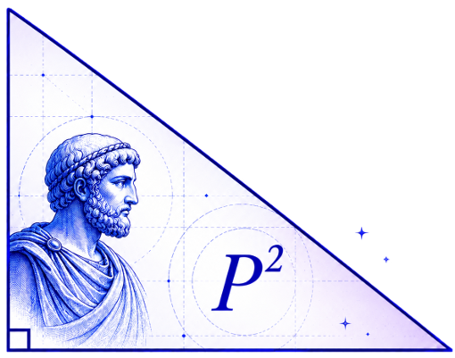
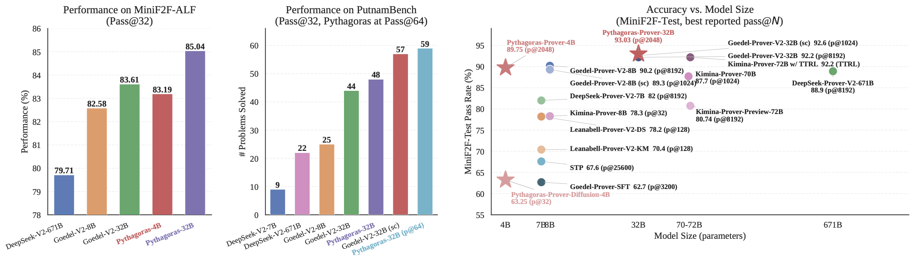

<div align="center">
  <br>
  <h1>Pythagoras-Prover</h1>
</div>

<div align="center">

[](https://arxiv.org/abs/XXXX.XXXXX)
[](https://huggingface.co/Pythagoras-LM)
[](https://github.com/Pythagoras-LM/Pythagoras-Prover)
[](https://github.com/Pythagoras-LM/Pythagoras-Prover)

</div>

<p align="center"><b>Paper Link &nbsp;|&nbsp; <a href="https://arxiv.org/abs/XXXX.XXXXX">arXiv</a></b></p>

<p align="center">
  <a href="#1-introduction">Introduction</a> |
  <a href="#2-model-summary">Model Summary</a> |
  <a href="#3-benchmark-performance">Benchmark Performance</a> |
  <a href="#4-model--dataset-downloads">Model &amp; Dataset Downloads</a> |
  <a href="#5-quick-start">Quick Start</a> |
  <a href="#citation">Citation</a>
</p>

# Pythagoras-Prover: Advancing Efficient Formal Proving via Augmented Lean Formalisation

## 1. Introduction

We introduce **Pythagoras-Prover**, a compute-efficient family of open-source large language models for formal theorem proving in Lean 4. The family comprises two autoregressive provers at 4B and 32B parameters, together with **Pythagoras-Prover-Diffusion**, the first diffusion-based theorem prover, which iteratively refines Lean proofs at inference time. All three models are artefacts of a single methodological approach: a scalable, Lean-verified synthetic data pipeline. At its centre is **Augmented Lean Formalisation** (ALF), a structured mutation scheme that expands a verified seed corpus into formal variants without per-instance Lean compilation, then re-uses them as a self-distillation signal during training. This design lets careful data construction stand in for raw scale, closing much of the gap between small open provers and their largest counterparts — without relying on inference-time self-correction.

<div align="center">
  
</div>

## 2. Model Summary

---

**A Lean-Verified Synthetic Data Pipeline**

- Natural-language problems from general-math and competition sources are autoformalised into Lean and gated on the type-checker using predominantly sub-30B open models, with an auto-informalisation and alignment step discarding faithful-but-wrong formalisations to yield a verified seed corpus partitioned into easy, medium, and hard tiers.
- A rubric-guided distillation stage re-prompts on each rejected instance to target the specific Lean type-checker error responsible for its failure, lifting autoformalisation success and roughly doubling the verified training set.

---

**Model Training**

- LoRA-only supervised fine-tuning of Qwen3-4B and Qwen3-32B under an 8K context, paired with a dynamic proof-reasoning filter and a difficulty-ordered easy→medium→hard curriculum, followed by reinforcement learning with a Lean-compilation reward and a final continued-SFT stage on the ALF corpus.

---

**Augmented Lean Formalisation**
- ALF emits one structured variant per category — simplification, generalisation, lemma proposal, proof-step decomposition, and reformulation — for every seed statement, replacing per-instance Lean verification with a cheap statement-alignment check and expanding the seed corpus into roughly 2M formal variants.
- The post-RL prover proves the mutations, and these self-distilled proofs form a corpus that trains both the autoregressive and diffusion provers from a single recipe.

---

**The Smallest Efficient Open-Source Lean Theorem Prover**

- We train Pythagoras-Prover-4B, one of the smallest and most compute-efficient open-source Lean theorem provers to date, reaching 86.07% on MiniF2F-Test at Pass@32 and surpassing the prior state of the art at a fraction of its parameter count.
- Pythagoras-Prover-Diffusion adapts a block-diffusion formulation with a tactic-based masking objective aligned to the discrete reasoning steps of Lean — to our knowledge the first demonstration that a diffusion language model can verifiably solve Lean theorems at non-trivial rates.

---

The resulting models set a new bar for compute-efficient formal proving. **Pythagoras-Prover-32B** achieves state-of-the-art performance among open-source provers, reaching **93.03%** on MiniF2F-Test and solving **93 of 672** problems on PutnamBench, while **Pythagoras-Prover-4B** outperforms DeepSeek-Prover-V2-671B on MiniF2F-Test despite being roughly **167× smaller** — with no self-correction or test-time reinforcement learning. We additionally release **MiniF2F-ALF**, an ALF-mutated companion benchmark on which every evaluated prover degrades.

## 3. Benchmark Performance

We evaluate Pythagoras-Prover on three Lean 4 benchmarks — MiniF2F-Test, PutnamBench, and the MiniF2F-ALF benchmark we introduce — under a single unified protocol (Lean 4.9.0-rc1, a 30,000-token generation limit, and a verbatim-statement pass criterion). Across all three, Pythagoras-Prover matches or exceeds open-source provers an order of magnitude larger, and does so **without** inference-time self-correction or test-time reinforcement learning.


<div align="center">
  <table style="margin: 0 auto;">
    <thead>
      <tr>
        <th>Method</th>
        <th>#Params</th>
        <th>Pass@32</th>
        <th>Pass@1024</th>
        <th>Best (N)</th>
      </tr>
    </thead>
    <tbody>
      <tr><td>Goedel-Prover-SFT</td><td>7B</td><td>57.6</td><td>–</td><td>62.7 (3200)</td></tr>
      <tr><td>STP</td><td>7B</td><td>–</td><td>–</td><td>67.6 (25600)</td></tr>
      <tr><td>Kimina-Prover-Preview-72B</td><td>72B</td><td>68.85</td><td>–</td><td>80.74 (8192)</td></tr>
      <tr><td>DeepSeek-Prover-V2-7B</td><td>7B</td><td>75.6</td><td>–</td><td>82.0 (8192)</td></tr>
      <tr><td>DeepSeek-Prover-V2-671B</td><td>671B</td><td>82.4</td><td>–</td><td>88.9 (8192)</td></tr>
      <tr><td>Kimina-Prover-8B-Distill</td><td>8B</td><td>77.86</td><td>–</td><td>–</td></tr>
      <tr><td>Kimina-Prover-70B</td><td>70B</td><td>84.0</td><td>87.7</td><td>92.2 (TTRL)</td></tr>
      <tr><td>Goedel-Prover-V2-8B</td><td>8B</td><td>84.6</td><td>87.9</td><td>90.2 (8192)</td></tr>
      <tr><td>&nbsp;&nbsp;+ Self-Correction</td><td>8B</td><td>86.7</td><td>89.3</td><td>–</td></tr>
      <tr><td>Goedel-Prover-V2-32B</td><td>32B</td><td>88.1</td><td>91.8</td><td>92.2 (8192)</td></tr>
      <tr><td>&nbsp;&nbsp;+ Self-Correction</td><td>32B</td><td>90.4</td><td>92.6</td><td>–</td></tr>
      <tr><td><strong>Pythagoras-Prover-4B</strong></td><td>4B</td><td><strong>86.07</strong></td><td><strong>88.11</strong></td><td><strong>89.75 (2048)</strong></td></tr>
      <tr><td><strong>Pythagoras-Prover-32B</strong></td><td>32B</td><td><strong>89.75</strong></td><td><strong>92.62</strong></td><td><strong>93.03 (2048)</strong></td></tr>
    </tbody>
  </table>
  <!-- table caption -->
  <caption align="bottom"><strong>Table 1</strong>: <em>Pythagoras-Prover-4B exceeds DeepSeek-Prover-V2-671B's pass@8192 result (88.9%) at pass@2048 — a quarter of the budget and ~167× fewer parameters. Pythagoras-Prover-32B sets the strongest reported MiniF2F-Test pass rate without self-correction or test-time RL.</em></caption>
</div>


<br>

<div align="center">
  <table style="margin: 0 auto;">
    <thead>
      <tr>
        <th>#</th>
        <th>Model</th>
        <th>num-solved</th>
        <th>compute</th>
      </tr>
    </thead>
    <tbody>
      <tr><td>1</td><td><strong>Pythagoras-Prover-32B</strong></td><td><strong>93</strong></td><td><strong>Pass@2048</strong></td></tr>
      <tr><td>1</td><td><strong>Pythagoras-Prover-32B</strong></td><td><strong>59</strong></td><td><strong>Pass@64</strong></td></tr>
      <tr><td>1</td><td><strong>Pythagoras-Prover-32B</strong></td><td><strong>48</strong></td><td><strong>Pass@32</strong></td></tr>
      <tr><td>2</td><td>Goedel-Prover-V2-32B (self-correction mode)</td><td>86</td><td>Pass@184</td></tr>
      <tr><td>2</td><td>Goedel-Prover-V2-32B (self-correction mode)</td><td>57</td><td>Pass@32</td></tr>
      <tr><td>2</td><td>Goedel-Prover-V2-32B</td><td>43</td><td>Pass@32</td></tr>
      <tr><td>3</td><td>DeepSeek-Prover-V2-671B</td><td>47</td><td>Pass@1024</td></tr>
      <tr><td>3</td><td>DeepSeek-Prover-V2-671B</td><td>22</td><td>Pass@32</td></tr>
      <tr><td>4</td><td>DSP+</td><td>23</td><td>Pass@128</td></tr>
      <tr><td>5</td><td>Bourbaki</td><td>14</td><td>Pass@512</td></tr>
      <tr><td>6</td><td>Kimina-Prover-7B-Distill</td><td>10</td><td>Pass@192</td></tr>
      <tr><td>7</td><td>Self-play Theorem Prover</td><td>8</td><td>Pass@3200</td></tr>
      <tr><td>8</td><td>Goedel-Prover-SFT</td><td>7</td><td>Pass@512</td></tr>
      <tr><td>9</td><td>ABEL (closed-source)</td><td>7</td><td>Pass@596</td></tr>
    </tbody>
  </table>
  <!-- table caption -->
  <caption align="bottom"><strong>Table 2</strong>: <em>PutnamBench leaderboard (problems solved out of 657). Pythagoras-Prover-32B takes the top rank, solving 93 problems at Pass@2048 — 7 more than the previous best (Goedel-Prover-V2-32B, 86 at Pass@184 in self-correction mode) and nearly double DeepSeek-Prover-V2-671B's 47 at Pass@1024, despite being roughly 20× smaller. Seed-Prover (331 solved) is omitted from the ranked rows as it is closed-source with undisclosed test-time compute.</em></caption>
</div>

<br>

<div align="center">
  <table style="margin: 0 auto;">
    <thead>
      <tr>
        <th>Model</th>
        <th>Pass@32</th>
      </tr>
    </thead>
    <tbody>
      <tr><td>DeepSeek-Prover-V2-671B</td><td>79.71</td></tr>
      <tr><td>Goedel-Prover-V2-8B</td><td>82.58</td></tr>
      <tr><td>Goedel-Prover-V2-32B</td><td>83.61</td></tr>
      <tr><td><strong>Pythagoras-Prover-4B</strong></td><td><strong>83.19</strong></td></tr>
      <tr><td><strong>Pythagoras-Prover-32B</strong></td><td><strong>85.04</strong></td></tr>
    </tbody>
  </table>
  <!-- table caption -->
  <caption align="bottom"><strong>Table 3</strong>: <em>Performance of current state-of-the-art provers on MiniF2F-ALF (Pass@32, %). As MiniF2F-ALF is introduced in this work, all results are evaluated by us under a unified setup.</em></caption>
</div>


## 4. Model & Dataset Downloads
We will be releasing Pythagoras-Prover in two sizes, 4B and 32B parameters, alongside Pythagoras-Prover-Diffusion-4B. For each model we provide both the post-SFT and final checkpoints. Pythagoras-Prover is built on the Qwen3 model series. To support future research, we are open-sourcing (gradually) our models, datasets, and a new benchmark.

<div align="center">
  
| Model | Download |
| -------- | -------- |
|    Pythagoras-Prover-32B    |   Coming Soon   |
|    Pythagoras-Prover-4B    |   [🤗Download](https://huggingface.co/Pythagoras-LM/Pythagoras-Prover-4B)    |
|    Pythagoras-Prover-Diffusion-4B    |   Coming Soon   |

</div>

<div align="center">

| Dataset | Download |
| -------- | -------- |
|   Pythagoras-Prover-SFT    |   Coming Soon    |
|   Pythagoras-Prover-Distill-4B    |   Coming Soon    |
|    Pythagoras-Prover-Distill-32B    |   Coming Soon    |
</div>

### TODOs
We will be releasing the checkpoints, datasets, and benchmarks gradually to support future research and replication.
- [🚀] Releasing 4B models 
- [🚀] Releasing 32B models 
- [🚀] Releasing Diffusion-4B model
- [🚀] Releasing Pythagoras-Dataset
- [🚀] Releasing MiniF2F-ALF
- [🚀] Releasing Source Code for Dataset

## Environment Setup
We follow <a href="https://github.com/deepseek-ai/DeepSeek-Prover-V1.5">DeepSeek-Prover-V1.5</a>, which uses Lean 4 (version 4.9) and the corresponding Mathlib. We have simplified the setup for easier installation.

### Installation
1. Install Lean and Mathlib:
```
curl https://elan.lean-lang.org/elan-init.sh -sSf | sh -s -- -y
source $HOME/.elan/env

cd /dev/shm
git clone --branch deepseek https://github.com/xinhjBrant/mathlib4.git
cd mathlib4
git checkout 2f65ba7
lake build
echo '{ "cmd" : "def f := 2" }' | lake exe repl
```

2. Install the required packages:
 ```
 pip install uv 
uv venv pythagoraslm --python 3.12 && source pythagoraslm/bin/activate && uv pip install --upgrade pip
uv pip install --upgrade vllm
uv pip install peft datasets accelerate
uv pip install setuptools && uv pip install flash-attn --no-build-isolation
 ```

> **Note:** The complete evaluation code will be released very soon.


## 5. Quick Start
For model inference., <a href="https://github.com/huggingface/transformers" target="_blank" rel="noopener">Huggingface's Transformers</a> can directly be used

```python
from transformers import AutoModelForCausalLM, AutoTokenizer
import torch

model_id = "Pythagoras-LM/Pythagoras-Prover-4B"
tokenizer = AutoTokenizer.from_pretrained(model_id)
model = AutoModelForCausalLM.from_pretrained(
    model_id,
    torch_dtype=torch.bfloat16,
    device_map="auto",
)

formal_statement = """
import Mathlib
import Aesop

set_option maxHeartbeats 0

open BigOperators Real Nat Topology Rat

/-- The volume of a cone is given by the formula $V = \frac{1}{3}Bh$, where $B$ is the area of the base and $h$ is the height. The area of the base of a cone is 30 square units, and its height is 6.5 units. What is the number of cubic units in its volume? Show that it is 65.-/
theorem mathd_algebra_478 (b h v : ℝ) (h₀ : 0 < b ∧ 0 < h ∧ 0 < v) (h₁ : v = 1 / 3 * (b * h))
(h₂ : b = 30) (h₃ : h = 13 / 2) : v = 65 := by
  sorry
""".strip()

prompt = """
Complete the following Lean 4 code:

```lean4
{}```

Before producing the Lean 4 code to formally prove the given theorem, provide a detailed proof plan outlining the main proof steps and strategies.
The plan should highlight key ideas, intermediate lemmas, and proof structures that will guide the construction of the final formal proof.
""".strip()

chat = [
  {"role": "user", "content": prompt.format(formal_statement)},
]

model = AutoModelForCausalLM.from_pretrained(model_id, device_map="auto", torch_dtype=torch.bfloat16, trust_remote_code=True)
inputs = tokenizer.apply_chat_template(chat, tokenize=True, add_generation_prompt=True, return_tensors="pt").to(model.device)

import time
start = time.time()
outputs = model.generate(inputs, max_new_tokens=8192)
print(tokenizer.batch_decode(outputs))
print(time.time() - start)
```

## 6. Inference and Evaluation
```
bash script/run_minif2f_pythagoras_4b.sh
```

# Citation
If you find Pythagoras-Prover useful, please cite:

```bibtex
@article{leang2026pythagoras,
  title   = {Pythagoras-Prover: Advancing Efficient Formal Proving via Augmented Lean Formalisation},
  author  = {Leang, Joshua Ong Jun and Zhao, Zheng and Stoian, Mihaela C{\u{a}}t{\u{a}}lina
             and Xu, Qiyuan and Li, Haonan and Li, Wenda and Cohen, Shay B. and Giunchiglia, Eleonora},
  year    = {2026}
}
```

# Contact 
If you have any question, please open an issue on this repository or contact j.ong25@imperial.ac.uk
